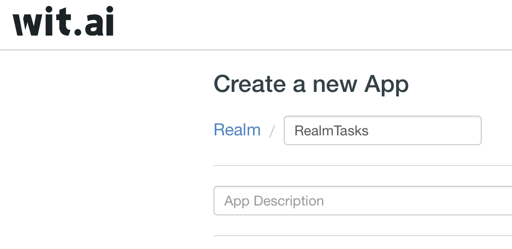
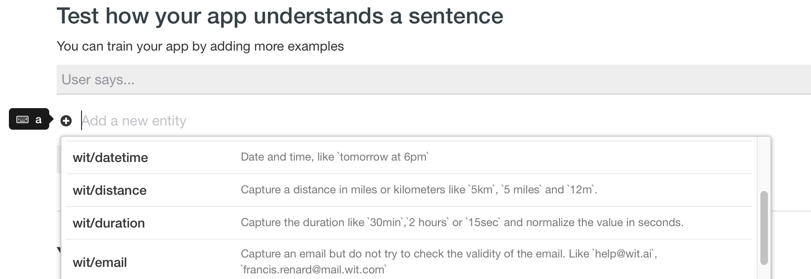
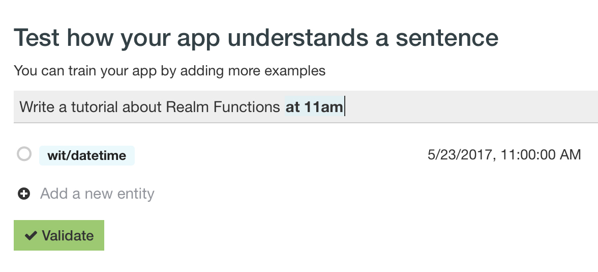
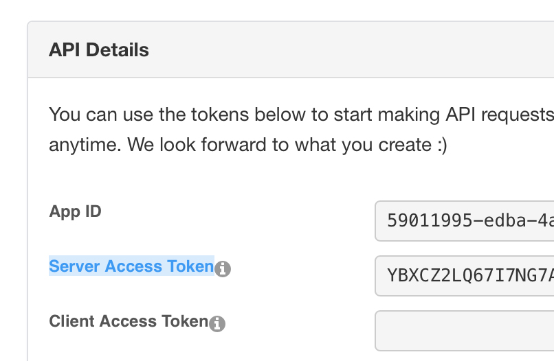

# Realm Tasks + Functions

> Realm Functions is a new feature for the Realm Mobile Platform that allows custom JavaScript functions to be executed
serverside in response to when the data in a user-facing Realm changes.

> This tutorial will walk you through setting up the iOS version of Realm Tasks in conjunction with a local instance of Realm Functions. When a task is added to Realm Tasks, Realm Functions will use wit.ai, a third party integration to analyze the task for any time references and pass any back to Realm Tasks as `NSDate` values.


# Requirements
* A Mac running macOS Sierra / El Capitan
* Xcode 8.3 (Running Swift 3.1)
* A command line app (Terminal works great)
* [CocoaPods](http://cocoapods.org)
* [Node.JS with NPM for Mac](https://nodejs.org/en/download/)

# 1. Download all of the necessary dependencies

Before proceeding, you'll need to make sure you have a copy of both the Realm Tasks source code, and a copy of the Realm Mobile Platform supporting Realm Functions.

* [Download the latest version of Realm Tasks](https://github.com/realm-demos/realm-tasks/archive/to/functions-tutorial.zip).
* [Download the latest version the Realm Mobile Platform bundle for macOS](https://realm.io/docs/get-started/installation/mac/).

# 2. Install the wit.ai NPM Dependency

Realm Functions is able to incorporate NPM packages from third party sources in order to further extend its functionality. Make sure you've installed Node.JS with NPM before you follow these steps.

1. In Terminal, navigate to the Realm Mobile Platform folder. (e.g. `cd ~/Projects/Realm-Mobile-Platform`)
2. To install wit.ai as a dependency, run the command:
```
PATH=.prefix/bin:$PATH npm install node-wit
```

# 3. Obtain an API Key from wit.ai
Before you can use their services, you must obtain an API key from wit.ai

1. Navigate to [http://wit.ai](http://wit.ai) and log in with your GitHub account.
2. Click on the '+' symbol to create a new app. Give the app a name ('RealmTasks' should be enough) and click 'Create App'.



3. To configure your app for understanding time, click 'Add a new entity', and choose 'wit/datetime'.



4. Try writing an example sentence to see if wit.ai will pick up your time references correctly.



5. Click on the 'Settings' button to go the settings page for your app.
6. In 'API Details', copy the value in 'Server Access Token'. This is your API key for integrating with wit.ai



# 4. Run the Realm Object Server
1. In the Realm Mobile Platform bundle you downloaded, open `start-object-server.command` to start running the Realm Object Server.
2. Navigate to `http://localhost:9080` in your browser and register a default admin account.  Log in with that account.

# 5. Set up a new Function
1. In the new Realm Dashboard, click on the 'Functions' option on the right.
2. Click `Create new Function` to be presented with the editor for a new JavaScript function.
3. Give the function a name. This name is only visible in the main list of Functions.
4. Update the regex expression so it matches the name of the Realm database we plan to track. In this case, it is `^/([0-9a-f]+)/realmtasks$`.
5. Replace the code in JavaScript editor with the following code. Paste in your wit.ai token for `WIT_ACCESS_TOKEN`

```js
var Wit = require("node-wit").Wit;
var WIT_ACCESS_TOKEN = ""; // UPDATE WITH API TOKEN
var witClient = new Wit({accessToken: WIT_ACCESS_TOKEN});

module.exports = function(change_event) {
    var realm = change_event.realm;
    var changes = change_event.changes.Task;
    var taskIndexes = changes.modifications;
    console.log("Change detected: " + changes);
    // Get the task objects to processes
    var tasks = realm.objects("Task");
    for (var i = 0; i < taskIndexes.length; i++) {
        var taskIndex = taskIndexes[i];
        // Retrieve the task object from the Realm with index
        var task = tasks[taskIndex];
        console.log("New task received: " + change_event.path);
        // get date from wit.ai
        // probably use this https://wit.ai/docs/http/20160526#get--message-link
        // node-wit: https://github.com/wit-ai/node-wit
        witClient.message(task.text, {}).then((data) => {
            console.log("Response received from wit: " + JSON.stringify(data));
            var dateTime = data.entities.datetime[0];
            if (!dateTime) {
                console.log("Couldn't find a date.");
                return;
            }
            console.log("Isolated calculated date: " + dateTime.value);
            // to write the date, we'll have to add a date property on the client and migrate it
            realm.write(function() {
                task.date = new Date(dateTime.value);
            });
        })
        .catch(console.error);
    }
};
```

6. Press the 'Save' icon, followed by the 'Play' icon for this script to start responding to events.

# 6. Run Realm Tasks in the iOS Simulator

Before proceeding make sure you've installed all of Realm Tasks' dependencies by navigating to the `RealmTasks Apple` directory in Terminal, and executing `pod install`.

1. With the Realm Object Server running locally on the same machine, build Realm Tasks and run it in the iOS Simulator.
2. On the Log In screen, register a new user, and tap 'Sign Up'.
3. Once logged in, create a new task by tapping on the screen.
4. Create a task with a time reference in it, such as 'Eat Dinner at 6pm'.

If all goes well, Realm Functions will detect the new item being added, and will trigger the wit.ai lookup. 

# Debugging Realm Functions

Underneath the JavaScript editor on the Functions page is a live console that will update in real-time when messages from the Object Server are received. If any unexpected issues arrive, be sure to check the console to see what issues you'll need to resolve.